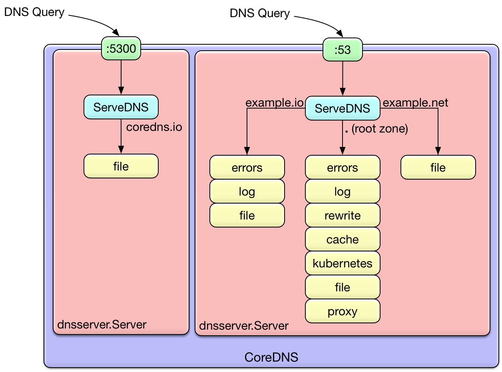

- DNS Server
- Kubernetes에서 기본 DNS로 채용하여 Cloud native DNS server로 사용
  - K8s 1.13 부터 공식채용이라고 하지만 1.11부터 기본적용 되어 있음
  - kube-dns로도 변경 가능
- written in Go
- [SkyDNS](https://github.com/skynetservices/skydns)의 후손, 이것도 Go, etcd 사용
- 역시 구글러가 제작; [Miek Gieben](https://miek.nl/tags/lego/)

## 장점
- flexible; pipelining plug-ins
  - plugin을 연결해서 각 DNS기능을 chaining
  - 요청마다 다른 chain 적용 가능; (protocol X zone name X port) 조합별로
  
  - [plugin 종류](https://coredns.io/plugins/)
  - 필요한 plugin만 선별해서 compile 가능. 무겁지 않음.
- [vs. kube-dns](https://coredns.io/2018/11/27/cluster-dns-coredns-vs-kube-dns/)
  - memory-efficient
    - kube-dns는 인스턴스가 3개가 떠있어서 기본적으로 메모리를 더 사용.
  - core-efficient
    - kube-dns는 single thread로 동작하기에 인스턴스당 core를 하나만 사용함.
  - external-query-efficient
    - kube-dns는 negative cache를 적용해도 느리더라

## kubernetes에서의 용도
K8s의 구성요소 : Master, Node, **Add-on**

### add-ons
- 정의 : 클러스터 내부에서 특정 기능들을 수행하는 pod
  - add-on 관리자 : deployment, replication controller
  - add-on이 사용하는 namespace : `kube-system`
- 종류
  - Networking add-on
  - Dashboard add-on
  - DNS add-on <- core-dns, kube-dns는 여기

### DNS add-on
- 실제로 클러스터 내에서 동작하는 DNS 서버
  - K8s 서비스들에게 DNS 레코드를 제공
  - K8s 컨테이너들은 자동으로 DNS서버에 등록됨
  - 인프라 직원 안 거치고 바로 변경가능한.....게 좋은거 같은데 일이 늘어나는게 안좋은거 같은데요.
- [k8s DNS Spec.](https://github.com/kubernetes/dns/blob/master/docs/specification.md)의 구현체
  - Kubernetes가 DNS-Based service discovery를 하기 위한 스펙
  - 이 스펙의 구현체가 DNS add-on
  - 그래서 같은 구현체인 kube-dns를 대체가능
- 특이한 점
  - 구 버전에서 CoreDNS를 세팅할 때 kube-dns 서비스를 그대로 이어받아 사용하기 때문에 runtime에 교체되고 롤백도 가능한 것.
  - 지금은 기본 DNS 로 쓰임
    - kube-dns로 자연스러운 교체를 지원하기 위해 kube-dns service이름를 유지함
    - 이걸 모르고 쓰는 사람은 이게 또 새로운 혼란포인트
	    - "core-dns, kube-dns 두개가 떠있는건가요??"

# 결론
Application 개발자는 API나 UI를 기다리자.

# 참고
- [Cluster DNS: CoreDNS vs Kube-DNS](https://coredns.io/2018/11/27/cluster-dns-coredns-vs-kube-dns/)
- [How Queries Are Processed in CoreDNS](https://coredns.io/2017/06/08/how-queries-are-processed-in-coredns/)
- [애드온 개념](https://arisu1000.tistory.com/27828)
  - 이 블로그 개념정리가 참 찰지네요
